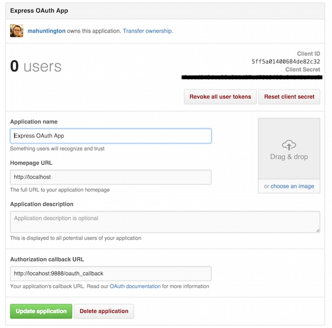

# Example Rails OAuth 2 App

This repo holds examples of how to add OAuth 2 to a Rails app built around the 
same basic structure as our simple BCrypt/Sign-up/Session auth system. In order
to run the examples and understand the code, make sure to do the following:

1. [Sign up your instance of the example app with GitHub.][s1]
1. [Review OAuth 2 and GitHub's API.][s2]
1. [Review the base Rails app.][s3]
1. ["Checkout" the examples!][ex]
  1. a hand-rolled OAuth 2 Web flow using API calls,
  1. a "low-level" OAuth 2 library: [`oauth2`][oauth2], and
  1. an OAuth flow with a provider-based API wrapper: [`octokit`][octokit]
  1. a "kitchen sink", all-in-one, API wrapper: [`github_api`][github_api]

## Sign up your instance of the example app with GitHub

In order to run this application you need to 

- Register your app under your [GitHub settings][settings].
- Fill out the form with the following application info and then click
  "Register application":
    - **Application Name**: `OAuth 2 Example App`
    - **Homepage URL**: `http://localhost`
    - **Authorization callback URL**: `http://localhost:9888/oauth_callback`
  - You should see something similar to this (different app name, tho):
  
- Add the Client ID and Client Secret values to your app's environment:
  - You can use [dotenv][dotenv] or simply export
    the values to your shell.
  - The values need to be named:
    - Client ID: `GITHUB_OAUTH_ID`
    - Client Secret: `GITHUB_OAUTH_SECRET`

## Review OAuth 2 and GitHub's API

- Following the (below) docs and the OAuth 2 flow diagram, we must add the 
  necessary routes to implement the GitHub Web flow:
  - [OAuth 2 Docs][oauth-docs], and a [simplified explanation][simple-docs]
  - [GitHub OAuth API Docs][github_docs]
  - [OAuth 2 Flow Diagram](oauth2-flow.jpg)

You can see this done very simply in [Express][exp-ex] or (less so, in) 
[Sinatra][sin-ex], as well. On these frameworks the flow is easier to follow, 
as all the requests and responses are formed up in a row.

## Review the base Rails app

**[branch `baseapp`][baseapp-branch]**   
... or `git checkout baseapp`

This app follows the basic format of WDI example Rails apps:

- Rails 4
- PostgreSQL
- No Minitest, no Turbolinks.
- Pry consoles instead of IRB.

It also uses a very simple User model with a unique email, a name, and a unique
OAuth user ID [(`oauth_uid`)__*__](#note1) as attributes, and a scaffolded set of 
routes to go along with that.

You must have defined the environmental variables `GITHUB_OAUTH_ID`, and
`GITHUB_OAUTH_SECRET` from above.

**Very important!** You must run the app with:

```
$ rails s -p 9888
```

*This ensures the port number matches the one registered on GitHub.*

---

## "Checkout" the examples!

The examples are all of how to "log in" with GitHub, store the
resulting access token in the users' session, and associate that account with a 
local ActiveRecord model (*User*).

*Note: because GitHub has a default `scope` (set of permissions that the user
grants to the application) that allows us to access basic user data, all the 
below examples omit declaring scopes for simplicity. This is unique to GitHub.*

Specifically, the examples show how to do this with:

1. [a hand-rolled OAuth 2 Web flow using API calls,][ex-1]
1. [a "low-level" OAuth 2 library: `oauth2`, and][ex-2]
1. [an OAuth flow with a provider-based API wrapper: `octokit`][ex-3]
1. [a "kitchen sink", all-in-one, API wrapper: `github_api`][ex-4]

### A hand-rolled OAuth 2 web flow

**[commit 0000000][handrolled-commit]**   
... or `git checkout handrolled`

> This commit adds a series of methods to the `SessionsController`, and 
> renames the route `sessions#create` to be the OAuth callback. It also
> generates a URL to the GitHub OAuth login page and renders it on the
> `sessions/new.html.erb` view.

The simplest, but most tedious, way to implement the OAuth 2 protocol is to
write out the necessary requests and responses using a relatively low-level 
HTTP abstraction.

This example uses the [`httparty`][httparty] gem to send requests to the GitHub
API (both to get an access token and to make signed requests on the users' 
behalf).

*Note: This example omits `state`, part of the OAuth 2 protocol, and only gets
a single access token instead of a refresh token. Both of these are done for
simplicity's sake. These are fixed in both of the below examples, but are
abstracted away.*

### A "low-level" OAuth 2 library: `oauth2`

**[commit 0000000][oauth2gem-commit]**   
... or `git checkout oauth2gem`

*(Uses version 1.0 of the gem.)*

> This commit adds a series of methods to the `SessionsController`, and 
> renames the route `sessions#create` to be the OAuth callback. It also
> generates a URL to the GitHub OAuth login page and renders it on the
> `sessions/new.html.erb` view.

`oauth2` is a very powerful, popular gem that implements the OAuth 2 protocol 
flow. This allows you to abstract out some of the grunt work, while allowing
"granular" control of interactactions with the given identity provider and its
API.

### An OAuth flow with a provider-based API wrapper: `octokit`

**[commit 0000000][octokit-commit]**   
... or `git checkout octokit`

*(Uses version 3.8 of the gem.)*

> This commit adds to the `SessionsController`, `routes.rb`, and the 
> `sessions/new.html.erb` view, as in the above example. It also adds
> extra "current user" caching methods to the `ApplicationController`, wrapping 
> the access token in an instance of `Octokit::Client`.

`octokit` is the official GitHub API wrapper. The name is a play on their
zoomorphic mascot, [Octocat][octocat], a hybrid octopus–cat styled after the
world-famous Sanrio characters.

This is an example of how to integrate an OAuth flow (which retrieves an access
token) with using an API-wrapper gem. The gem signs API requests using the 
access token, and offers a semantic interface to the developer.

### A "kitchen sink", all-in-one, API wrapper: `github_api`

**[commit 0000000][github_api-commit]**   
... or `git checkout github_api`

*(Uses version 0.12 of the gem.)*

> This commit adds to the `SessionsController`, `routes.rb`, and the 
> `sessions/new.html.erb` view, as in the above example. It also adds
> extra "current user" caching methods to the `ApplicationController`, as
> above. However, all interaction with GitHub runs thru the `github_api` gem.

`github_api` is an example of the **most popular way to implement OAuth 2**: 
API-wrapper gems that combine services for OAuth and API requests. Sometimes 
these gems are officially supported by the identity provider (eg: 
[PayPal][pp-gem], [Instagram][in-gem], [DropBox][db-gem]), sometimes they are 
maintained by third parties ([Facebook][fb-gem], [Twitter][tw-gem]). 
`github_api` is maintained by [Peter Murach](https://github.com/peter-murach).

These gems abstract the OAuth process at a very high level, but also confuse 
that process with using access tokens (received via OAuth) to [make API requests
on behalf of the user.__**__](#note2) They promise simplicity but can often have 
the highest learning curve to use.

---

**Notes:**

<a name="note1"></a>

__*__ – The OAuth Unique ID attribute (`oauth_uid`) is on the User model in
order that we connect the local user to the credentials passed from the
identity provider. In a system where you have multiple identity providers this
would need to be a bit more complex, perhaps having the attribute store a JSON
list of key- value pairs, like:

```json
{
  "GitHub": "34598258",
  "Facebook": "",
  "Google": "pj@ga.co"
}
```

<a name="note2"></a>

__**__ – This is a very big, very common confusion! An "access token" received
via OAuth will allow your application to make API requests **for your user**.
The "API key" we use elsewhere to access APIs from our applications are
used to authenticate **your app**, not a user of your app. There is a good 
chance you may even use each, in different ways, at the same time!

<!-- LINKS -->

[settings]:   https://github.com/settings/applications/new
[octocat]:    https://octodex.github.com

[oauth2]:     https://github.com/intridea/oauth2
[octokit]:    https://github.com/octokit/octokit.rb
[github_api]: https://github.com/peter-murach/github
[dotenv]:     https://github.com/bkeepers/dotenv
[httparty]:   https://github.com/jnunemaker/httparty

[oauth-docs]:  http://oauth.net/2
[simple-docs]: http://aaronparecki.com/articles/2012/07/29/1/oauth2-simplified
[github_docs]: https://developer.github.com/v3/oauth/#web-application-flow

[exp-ex]: https://github.com/ga-instructors/express_oauth_app
[sin-ex]: https://github.com/h4w5/oauth_comprehensive_tester_app

[s1]:   #sign-up-your-instance-of-the-example-app-with-github
[s2]:   #review-oauth-2-and-githubs-api
[s3]:   #review-the-base-rails-app
[ex]:   #checkout-the-examples
[ex-1]: #a-hand-rolled-oauth-2-web-flow
[ex-2]: #a-low-level-oauth-2-library-oauth2
[ex-3]: #an-oauth-flow-with-a-provider-based-api-wrapper-octokit
[ex-4]: #a-kitchen-sink-all-in-one-api-wrapper-github_api

[in-gem]: https://github.com/Instagram/instagram-ruby-gem
[pp-gem]: https://github.com/paypal/PayPal-Ruby-SDK
[db-gem]: https://github.com/dropbox/dropbox-sdk-ruby
[tw-gem]: https://github.com/sferik/twitter
[fb-gem]: https://github.com/arsduo/koala

[baseapp-branch]:    https://github.com/ga-instructors/rails_oauth_app/tree/baseapp
[handrolled-commit]: https://github.com/ga-instructors/rails_oauth_app/commit/0000000
[oauth2gem-commit]:  https://github.com/ga-instructors/rails_oauth_app/commit/0000000
[octokit-commit]:    https://github.com/ga-instructors/rails_oauth_app/commit/0000000
[github_api-commit]: https://github.com/ga-instructors/rails_oauth_app/commit/0000000
